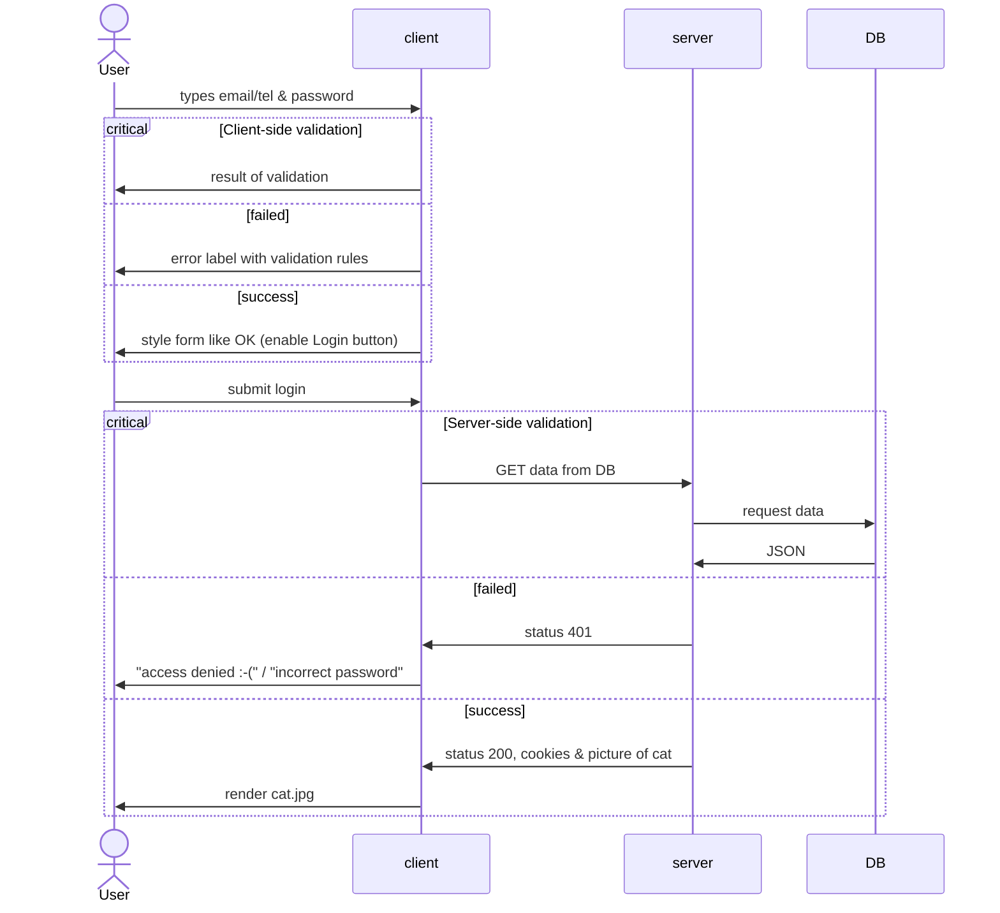

```mermaid
sequenceDiagram
    %%https://mermaid-js.github.io/mermaid/#/sequenceDiagram
    actor User
    participant client
    participant server
    participant DB

    User->>client: types email/tel & password 

    critical Client-side validation
        client->>User: result of validation
    option failed
        client->>User: error label with validation rules
    option success
        client->>User: style form like OK (enable Login button)
    end

    User->>client: submit login

    critical Server-side validation
        client->>server: GET data from DB
        server->>DB: request data 
        DB->>server: JSON
    option failed
        server->>client: status 401
        client->>User: "access denied :-(" / "incorrect password"
    option success
        server->>client: status 200, cookies & picture of cat
        client->>User: render cat.jpg
    end

```
