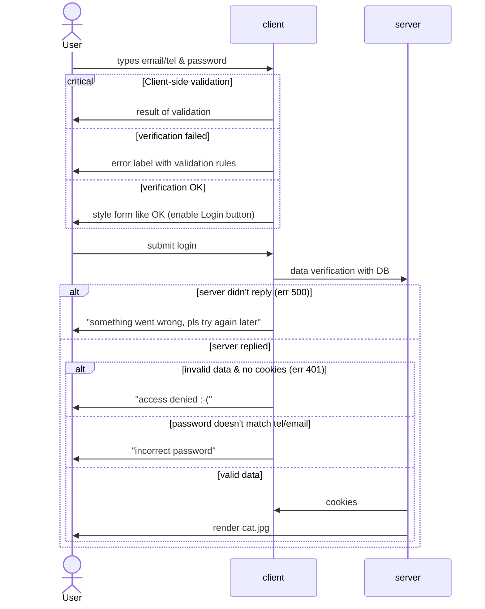

```mermaid
sequenceDiagram
    %%https://mermaid-js.github.io/mermaid/#/sequenceDiagram
    actor User
    participant client
    participant server

    User->>client: types email/tel & password 

    critical Client-side validation
        client->>User: result of validation
    option verification failed
        client->>User: error label with validation rules
    option verification OK
        client->>User: style form like OK (enable Login button)
    end

    User->>client: submit login

    client->>server: data verification with DB

    alt server didn't reply (err 500)
        client->>User: "something went wrong, pls try again later"

    else server replied
        alt invalid data & no cookies (err 401)
            client->>User: "access denied :-("
        else password doesn't match tel/email 
            client->>User: "incorrect password"
        else valid data
            server->>client: cookies
            server->>User: render cat.jpg
        end
    end
    
```