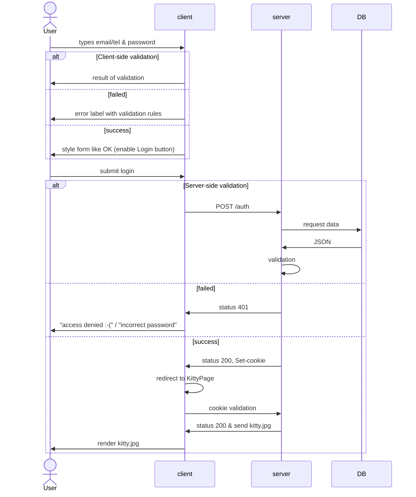

```mermaid
sequenceDiagram
    %%https://mermaid-js.github.io/mermaid/#/sequenceDiagram
    actor User
    participant client
    participant server
    participant DB

    User->>client: types email/tel & password 

    alt Client-side validation
        client->>User: result of validation
    else failed
        client->>User: error label with validation rules
    else success
        client->>User: style form like OK (enable Login button)
    end

    User->>client: submit login

    alt Server-side validation
        client->>server: POST /auth
        server->>DB: request data 
        DB->>server: JSON
        server->>server: validation
    else failed
        server->>client: status 401
        client->>User: "access denied :-(" / "incorrect password"
    else success
        server->>client: status 200, Set-cookie;
        client->>client: redirect to KittyPage;
        client->>server: cookie validation;
        server->>client: status 200 & send kitty.jpg;
        client->>User: render kitty.jpg;
    end

```
